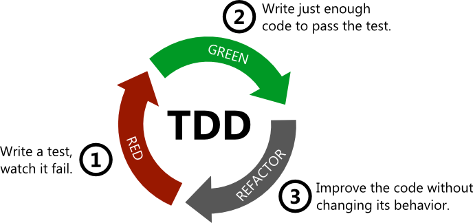

Hello Python, Hi TDD!
========================

Introduction
+++++++++++++
Hi and welcome to the Python-TDD tutorial where we are gonna learn **Python**
by **TDD**. It's more advanced **Python** which means that you must
have basic experience with this language.

So here you will learn and practice how to write custom *decorator*,
*iterator*, *context manager* etc. Hope that you will enjoy it.

What is TDD?
++++++++++++++
`TDD (Test Driven Development) <https://en.wikipedia.org/wiki/Test-driven_development/>`_
- is a software development process that relies on the repetition of a very short
development cycle:  requirements are turned into very specific test cases, then the
software is improved to pass the new tests, only.

   TDD.

How to start for TDD
---------------------
Here are the four steps required to do the TDD which one should remember by heart

1. Write “enough” failing tests before writing the production code
2. Write production code to pass those failing tests
3. Re-factor the code, if required.
4. GoTo Step — 1

You are lucky
---------------------
Fortunately for you we have written tests for your tasks. So you will start your cycle
from the *second* step. **[step-2, step-3, step-4]** *<next>* **[2, 3, 4]** *<next>*
**[2, 3, 4]** ...

Module structure
++++++++++++++++++
Every module have the next structure:
::

| module
| ├── answers               (our implementation)
| │   └── program.py
| ├── tests                 (tests)
| │   ├── test_program.py
| ├── program.py            (your implementation)
| ├── instruction.md        (what to do and how to run test)

+---------------+--------------+--------------------------------------------------------------------------+
| Folder/File   | Example      | Description                                                              |
+===============+==============+==========================================================================+
| ***.py**      | *program.py* | All ***.py** files in the root directory you have to implement.          |
|               |              |                                                                          |
+---------------+--------------+--------------------------------------------------------------------------+
| **tests/***   | *test_\*\.py*| Tests you have to run without failures.                                  |
|               |              |                                                                          |
+---------------+--------------+--------------------------------------------------------------------------+
| **answers/*** | *program.py* | Our implementation you can compare with your                             |
|               |              |                                                                          |
+---------------+--------------+--------------------------------------------------------------------------+
